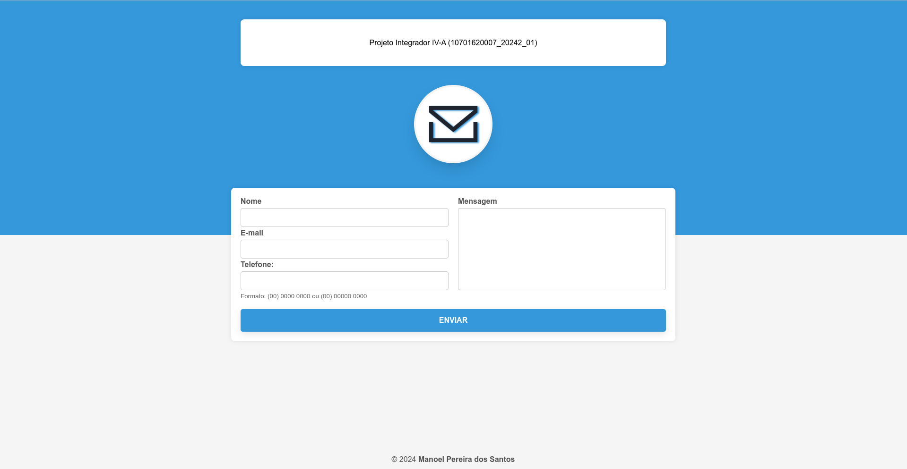
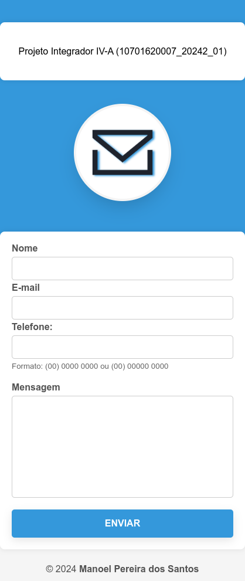

# Projeto Integrador IV-A (10701620007_20242_01)

Projeto criado em PHP, HTML e CSS.

Projeto de `landing page responsiva` para cadastro de mensagens em banco de dados PostgreSQL.

Disciplina: Projeto Integrador IV-A (10701620007_20242_01)

## Proposta:

Neste trabalho, você irá criar uma landing page (página de destino) da Faesa. Ou
seja, você criará uma página com um formulário em que o usuário digitará as
informações e essas serão armazenadas no banco de dados.

ALGUMAS CONSIDERAÇÕES:

-   Utilize imagens, animações em sua página;
-   Utilizar PHP, HTML e CSS
-   Criar um banco de dados para armazenar as informações que forem submetidas no
    formulário;
-   Validar as informações submetidas para evitar que dados indevidos sejam enviados.

## Pré-requisitos

-   Tenha o PHP 8
-   Tenha o PostgreSQL
-   Tenha o apache ou qualquer servidor HTTP da sua preferência

## Executando o projeto

Para clonar o projeto, execute no terminal ou prompt o comando abaixo dentro do diretório padrão do servidor http da sua escolha, conforme requisitos:

`git clone git@github.com:manoelps/Projeto-Integrador-IV-A-10701620007_20242_01-.git`

Crie um banco de dados no `PostgreSQL`

Abra o projeto em algum editor de texto ou IDE, e acesse o arquivo `connect.php` e configure a seguinte sessão conforme o seu ambiente:

```
$host = "localhost";
$port = "5432";
$dbname = "nome_do_banco";
$user = "usuario";
$password = "senha";
```

Execute o seguinte script no seu banco criado anteriormente, para criar a tabela de registros:

```
CREATE TABLE public.registros (
	id serial4 NOT NULL,
	nome varchar(255) NULL,
	email varchar(255) NULL,
	telefone varchar(14) NULL,
	mensagem text NULL,
	created_at timestamp NOT NULL DEFAULT now(),
	CONSTRAINT registros_pkey PRIMARY KEY (id)
);
```

## navegando

Agora o seu navegador e acesse a url correspondente ao projeto, preencha todos os campos e faça o envio do formulário, para verificar o funcionamento.

## screenshot




